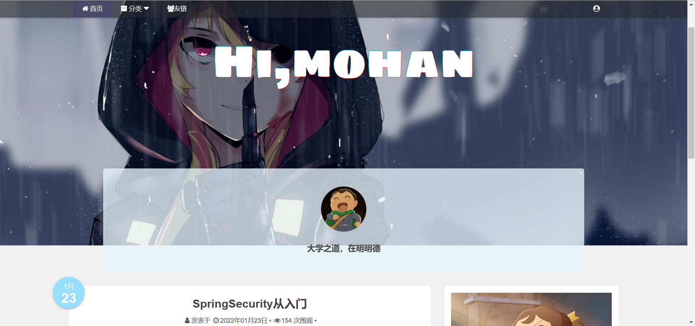
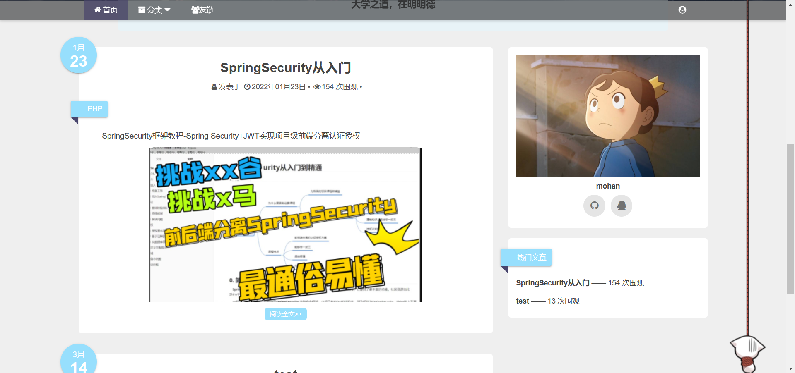
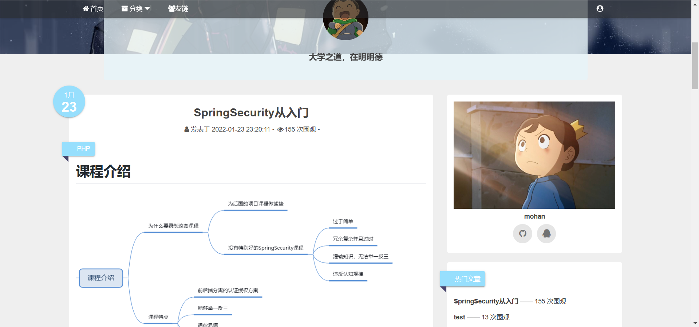
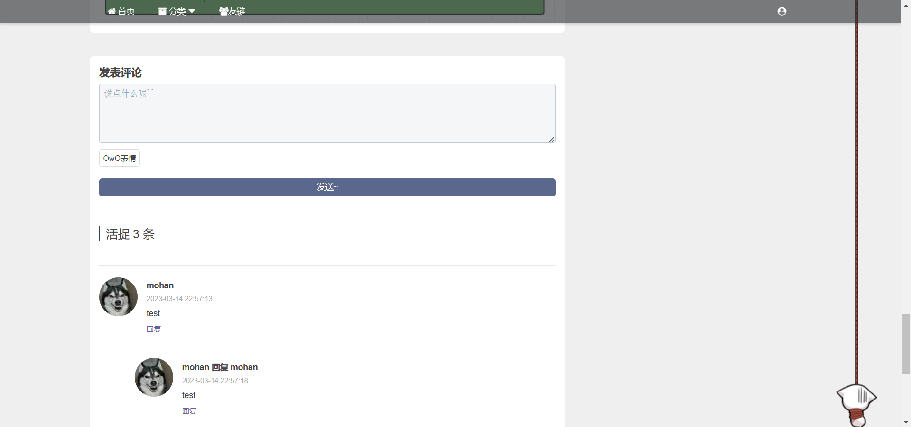
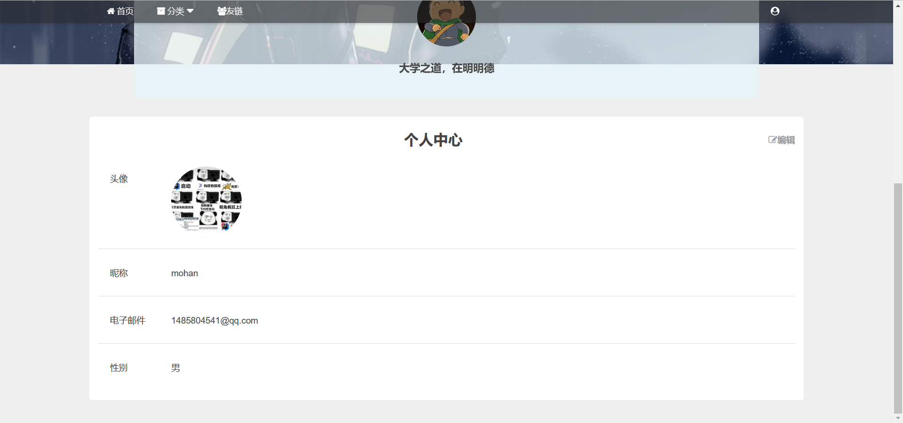
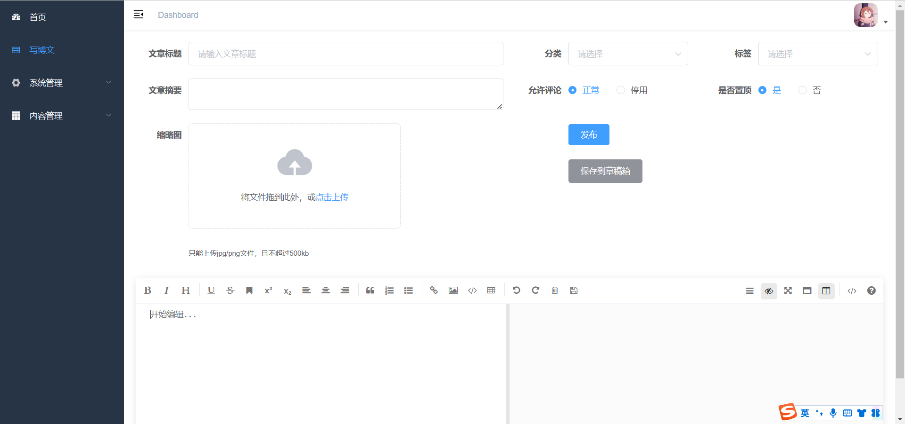
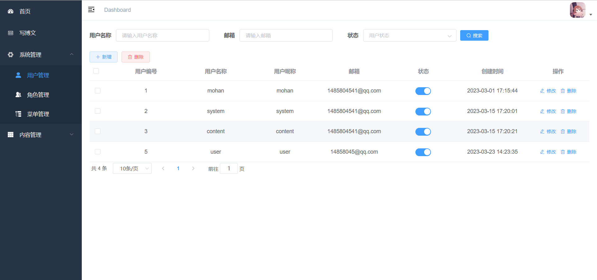
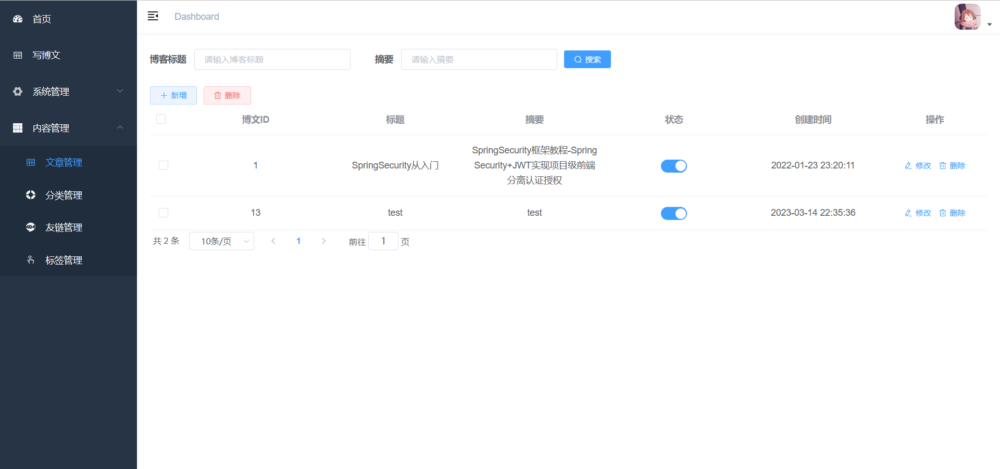
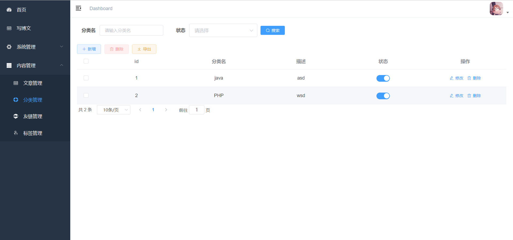

# 个人博客
一个简单的 vue + springboot 前后端分离个人博客项目

# 使用技术
jdk：8

mysql：5.7

redis：6.2

springboot：2.6.12

mybatisPlus：3.4.3

springfox-swagger2：3.0.0

easyexcel：3.0.5

七牛云oss：[7.7.0, 7.10.99]

安全框架使用 SpringSecurity

# 预览
**前台**

**后台**

前台地址：http://8.130.14.138:8093/

账号：user     151463

# 鸣谢
项目参考B站三更草堂个人博客项目：

https://www.bilibili.com/video/BV1hq4y1F7zk/

项目部署参考文章：

https://blog.csdn.net/weixin_51285339/article/details/128839388

https://blog.csdn.net/qq_52030824/article/details/127982206

